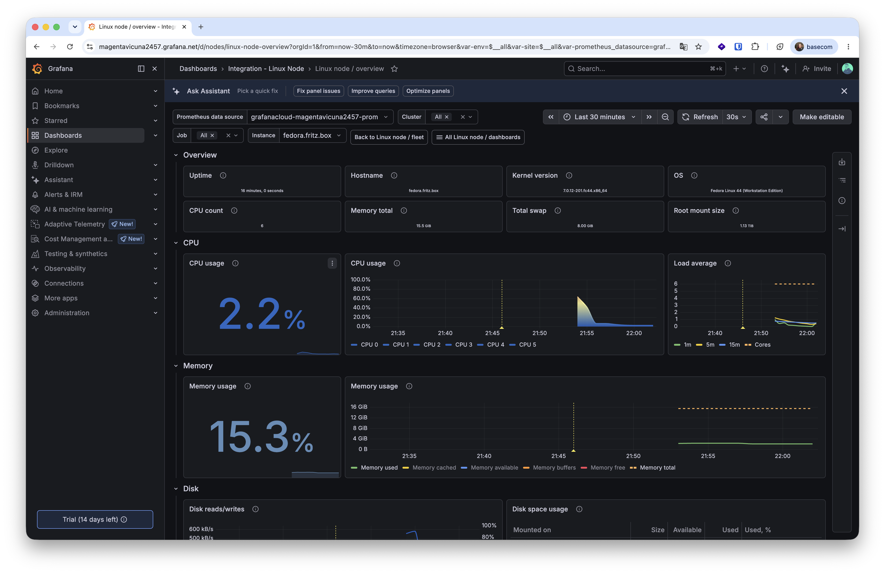

# Todo-Listen-Verwaltung – Deployment auf Raspberry Pi OS

REST-API für Todo-Listen (Python/Flask), deployed als Docker-Container auf einem
Raspberry Pi. Diese Anleitung beschreibt die komplette Einrichtung ausgehend von
einem unveränderten Raspberry Pi OS Lite (64-bit) Image. Die gesamte Einrichtung
erfolgt **per SSH** von einem anderen Rechner aus (siehe Schritt 1).

## Repository-Inhalt

```
.
├── app.py                              # Flask-Implementierung der REST-API
├── todolistenverwaltung_openapi.yaml   # OpenAPI-Spezifikation
├── Dockerfile                          # Container-Definition
├── Caddyfile                           # Reverse-Proxy-Konfig (Zusatzaufgabe 2)
└── README.md                           # Diese Anleitung
```

> **Hinweis zu den IP-Adressen:** Alle Adressen in dieser Anleitung sind an
> unser Netzwerk angepasst. Wer die Anleitung nachvollzieht, muss eine **eigene,
> freie IP-Adresse** im jeweiligen Subnetz wählen sowie Gateway und DNS des
> eigenen Netzwerks eintragen (siehe Schritt 2).

---

## Links

- **Frontend (live):** [todo-list-frontend-eight-omega.vercel.app](https://todo-list-frontend-eight-omega.vercel.app/)
- **Frontend Repository:** [https://github.com/jakobschltr/bbs-jakob-schlueter-todo-app-frontend](https://github.com/jakobschltr/bbs-jakob-schlueter-todo-app-frontend)
- **Backend Repository:** [https://github.com/jakobschltr/bbs-jakob-schlueter-todo-app-backend](https://github.com/jakobschltr/bbs-jakob-schlueter-todo-app-backend)

Das **Backend** ist eine Python/Flask-API für Listen und Todo-Einträge; die
Schnittstelle ist in `todolistenverwaltung_openapi.yaml` beschrieben (OpenAPI). Das
**Frontend** läuft als Web-App auf Vercel und bietet die Oberfläche für
Todo-Sammlungen und Listen (Link siehe oben).

> **Hinweis zum Frontend-Zugriff:** Da das Frontend per HTTPS auf Vercel läuft,
> das Backend aber unter einer lokalen IP (`192.168.24.114:5000`) erreichbar ist,
> fragt der Browser beim ersten Aufruf nach der Erlaubnis, auf das lokale
> Netzwerk zuzugreifen („Auf andere Apps und Dienste auf diesem Gerät
> zugreifen"). Diese Abfrage muss mit **Zulassen** bestätigt werden, sonst kann
> das Frontend die API nicht erreichen.

---

## 1. SSH-Dienst einrichten und verbinden

Damit die gesamte Einrichtung per SSH von einem anderen Rechner aus erfolgen
kann, muss der SSH-Dienst auf dem Pi laufen.

### 1.1 SSH aktivieren

Die einfachste Methode: beim Schreiben des Images mit dem **Raspberry Pi Imager**
unter den erweiterten Einstellungen SSH direkt aktivieren.

Zur Sicherheit lässt sich SSH auch manuell installieren und starten (direkt am
Pi oder über eine bereits bestehende Verbindung):

```bash
sudo apt update
sudo apt install -y openssh-server
sudo systemctl enable ssh
sudo systemctl start ssh
```

Status prüfen:

```bash
sudo systemctl status ssh
```

> Erwartete Ausgabe enthält `enabled` und `active (running)`.

### 1.2 Per SSH verbinden

Zuerst die aktuelle (per DHCP vergebene) IP des Pi ermitteln — z. B. über die
Geräteliste des Routers oder direkt am Pi mit `hostname -I`. Anschließend mit dem
Standardbenutzer `pi` verbinden:

```bash
ssh pi@192.168.24.146
```

Beim allerersten Verbinden fragt SSH, ob der Host-Schlüssel akzeptiert werden
soll — mit `yes` bestätigen. Der Schlüssel wird dann in `~/.ssh/known_hosts`
gespeichert. Danach das Passwort des `pi`-Benutzers eingeben.

> **Mögliches Problem — „REMOTE HOST IDENTIFICATION HAS CHANGED!":** Wurde unter
> derselben IP zuvor ein anderer Raspberry Pi betrieben (anderer Host-Schlüssel),
> verweigert SSH die Verbindung als Schutz vor Man-in-the-Middle-Angriffen. Den
> alten Schlüssel für die IP entfernen und erneut verbinden:
>
> ```bash
> ssh-keygen -R 192.168.24.146
> ssh pi@192.168.24.146
> ```

> **Hinweis zur Locale-Warnung:** Meldungen wie
> `setlocale: LC_CTYPE: cannot change locale (UTF-8)` beim Login sind harmlos und
> beeinträchtigen die Einrichtung nicht. Sie entstehen, weil der lokale Rechner
> seine Spracheinstellung mitsendet, die der Pi nicht kennt.

Sobald die Verbindung steht, werden alle folgenden Schritte in dieser
SSH-Sitzung auf dem Pi ausgeführt.

---

## 2. Statische IP-Adresse konfigurieren

Raspberry Pi OS (Bookworm) nutzt NetworkManager. Die Konfiguration erfolgt mit
`nmcli` und ist automatisch persistent.

### 2.1 Gateway und DNS ermitteln

Solange der Pi noch per DHCP verbunden ist, lassen sich Gateway und DNS-Server
des Netzwerks direkt auslesen.

**Gateway (Standardroute):**

```bash
ip route | grep default
```

Die Adresse hinter `default via` ist das Gateway:

```
default via 192.168.24.254 dev eth0 proto dhcp ...
```

**DNS-Server:**

```bash
nmcli dev show eth0 | grep DNS
```

Alle Werte (IP, Gateway, DNS) der aktuellen Verbindung auf einen Blick:

```bash
nmcli dev show eth0
```

> In unserem Netzwerk liegt das Gateway bei **`192.168.24.254`** und das Subnetz
> ist **`192.168.24.0/24`**. In einem anderen Netzwerk liefern die obigen
> Befehle entsprechend andere Adressen.

### 2.2 Statische IP setzen

Zuerst den Namen der aktiven Verbindung ermitteln:

```bash
nmcli connection show
```

Anschließend die statische IP setzen. **Wichtig:** Gateway und Adresse müssen im
gleichen Subnetz liegen (hier: `192.168.24.0/24`):

```bash
sudo nmcli connection modify "netplan-eth0" \
  ipv4.method manual \
  ipv4.addresses 192.168.24.114/24 \
  ipv4.gateway 192.168.24.254 \
  ipv4.dns "192.168.24.254"

sudo nmcli connection down "netplan-eth0"
sudo nmcli connection up "netplan-eth0"
```

> **Hinweis:** Da sich die IP-Adresse ändert, **bricht die aktuelle SSH-Sitzung
> hier ab**. Anschließend unter der neuen, statischen IP neu verbinden. Bei Problemen ggf. den RaspberryPi kurz vom Strom trennen zum neustarten.
>
> ```bash
> ssh pi@192.168.24.114
> ```

### 2.3 Systemzeit setzen (wichtig beim Raspberry Pi 3)

Der Raspberry Pi 3 besitzt **keine batteriegepufferte Echtzeituhr (RTC)** — in
`timedatectl` steckt meist ein bereits längst vergangenes Datum. Nach dem Einschalten startet er daher mit
einer veralteten Uhrzeit. Eine falsche Systemzeit blockiert die weiteren Schritte:

- `sudo apt update` scheitert an der Signaturprüfung:
  `Sub-process /usr/bin/sqv returned an error code (1) ... Not live until …`
- Der Image-Bau (`docker image build`) bricht beim Laden des Basis-Images ab:
  `tls: failed to verify certificate: x509: certificate has expired or is not yet
  valid: current time … is before …`

Zeit und Status prüfen:

```bash
timedatectl
```

Steht dort `System clock synchronized: no`, muss die Uhr korrigiert werden.
Für die einfachheit wird daher die Zeit **manuell** gesetzt.

**Wichtig:** Solange NTP aktiv ist, lässt sich die Zeit nicht manuell setzen
(`Failed to set time: Automatic time synchronization is enabled`). Deshalb zuerst
NTP deaktivieren, dann die Zeit setzen:

```bash
sudo timedatectl set-ntp false
sudo timedatectl set-time "2026-06-16 12:00:00"
```

Alternativ geht auch `date` (gleiches Format beachten — Trennung mit Bindestrichen
im Datum und Doppelpunkten in der Uhrzeit):

```bash
sudo date -s "2026-06-16 12:00:00"
```

> **Hinweis:** Die im Befehl angegebene Uhrzeit ist nur ein Beispiel — hier die
> **tatsächliche aktuelle Uhrzeit und Datum** eintragen. Die Zeit muss nicht
> sekundengenau sein, aber das aktuelle Datum ist entscheidend, damit die
> Signatur- und Zertifikatsprüfungen funktionieren.

Anschließend prüfen:

```bash
date
```

> **Hinweis:** Da der Pi 3 die Zeit über einen Neustart **nicht hält**, muss sie
> nach jedem Boot erneut gesetzt werden, bevor `apt`, `git clone` oder
> `docker build` funktionieren.

---

## 3. Benutzer anlegen

### Benutzer `willi` (ohne Administratorrechte)

```bash
sudo adduser willi
```

- Passwort setzen -> z.B. "raspberry"
- Der Eingabemaske folgen und am Ende bestätigen

### Benutzer `fernzugriff` (mit sudo-Rechten)

```bash
sudo adduser fernzugriff
```

- Passwort setzen -> z.B. "raspberry"
- Der Eingabemaske folgen und am Ende bestätigen

```bash
sudo usermod -aG sudo fernzugriff
```

---

## 4. SSH-Zugang absichern

Den Zugang auf `fernzugriff` beschränken, damit sich kein anderer Benutzer
(z. B. `willi` oder `pi`) von außen anmelden kann. Dazu folgende Zeile ans Ende
von `/etc/ssh/sshd_config` anfügen:

```bash
echo "AllowUsers fernzugriff" | sudo tee -a /etc/ssh/sshd_config
sudo systemctl reload ssh
```

Ab jetzt ist die Administration nur noch über `fernzugriff` möglich. Die aktuelle
`pi`-Sitzung beenden und unter dem neuen Benutzer neu verbinden:

```bash
exit
ssh fernzugriff@192.168.24.114
```

---

## 5. Docker installieren

> **Vor der Installation:** Systemzeit prüfen (siehe Schritt 2.3) — bei falscher
> Uhr scheitert `apt update` an der Signaturprüfung (`Not live until …`) und es
> lassen sich keine Pakete installieren.

Installation über die Paketverwaltung:

```bash
sudo apt update
sudo apt install -y docker.io
```

Docker-Dienst starten und für den automatischen Start beim Booten aktivieren:

```bash
sudo systemctl start docker
sudo systemctl enable docker
```

Installation testen:

```bash
sudo docker run hello-world
```

Erwartete Ausgabe
```
Hello from Docker!
```


Optional: Benutzer zur `docker`-Gruppe hinzufügen, um `docker` ohne `sudo`
auszuführen:

```bash
sudo usermod -aG docker fernzugriff
```

> **Hinweis:** Die Gruppenmitgliedschaft wird erst nach einer **neuen
> SSH-Sitzung** wirksam (einmal `exit`, dann neu verbinden). Bis dahin liefert
> `docker ps` „permission denied" und die Befehle benötigen weiterhin `sudo`.

---

## 6. Projektdateien auf den Server übertragen

Zuerst prüfen, ob Git bereits installiert ist:

```bash
git --version
```

Wird eine Versionsnummer ausgegeben, ist Git vorhanden und dieser Schritt kann
übersprungen werden. Erscheint stattdessen `command not found`, Git nachinstallieren:

```bash
sudo apt update
sudo apt install -y git
```

Anschließend das Backend-Repository klonen:

```bash
git clone https://github.com/jakobschltr/bbs-jakob-schlueter-todo-app-backend.git
cd bbs-jakob-schlueter-todo-app-backend
```

Alternativ per `scp` vom eigenen Rechner aus (ohne Git):

```bash
scp app.py Dockerfile fernzugriff@192.168.24.114:~/todo-app/
```

> **Hinweis:** Schlägt `git clone` mit einem SSL-/Zertifikatsfehler fehl, ist
> meist die Systemzeit falsch (siehe Schritt 2.3).
> **Hinweis** bei Kopie über `scp` und Einrichtung des Caddy Reverse Proxy
> muss die Caddyfile auch übertragen werden oder auf dem System erstellt werden.

---

## 7. Container-Image bauen

Das Dockerfile basiert auf einem schlanken Alpine-Python-Image, installiert
Flask und kopiert die Anwendung in den Container:

Image bauen (im Projektverzeichnis ausführen):

```bash
sudo docker image build -t webapp .
```

---

## 8. Container starten

```bash
sudo docker run -p 5000:5000 -d --restart unless-stopped --name todo-app webapp
```

Erläuterung der Optionen:

| Option | Bedeutung |
|--------|-----------|
| `-p 5000:5000` | Leitet Port 5000 des Containers auf Port 5000 des Hosts um |
| `-d` | Startet den Container im Hintergrund (detached) |
| `--restart unless-stopped` | Startet den Container nach einem Systemneustart automatisch wieder |
| `--name todo-app` | Fester Name für die spätere Verwaltung |

Laufende Container anzeigen:

```bash
sudo docker ps
```

Die API ist anschließend erreichbar unter:

```
http://192.168.24.114:5000/todo-list
```

---

## 9. Neustart-Test

Alle Einstellungen müssen einen Neustart überstehen. Test:

```bash
sudo reboot
```

Nach dem Hochfahren prüfen:

```bash
ssh fernzugriff@192.168.24.114        # statische IP + SSH funktionieren
sudo systemctl status docker          # Docker-Dienst läuft
sudo docker ps                        # Container "todo-app" ist "Up"
```

### Funktionstest der API

Den Endpunkt `/todo-list` abfragen, der alle Listen zurückgibt:

```bash
curl http://192.168.24.114:5000/todo-list
```

Erwartete Ausgabe (die drei vordefinierten Beispiellisten aus `app.py`):

```json
[
  {
    "id": "3530b3f0-fa39-4a48-9aa9-c36533817643",
    "name": "Einkaufsliste"
  },
  {
    "id": "0881e37f-5667-44be-b22f-1d7bb70e503b",
    "name": "Arbeit"
  },
  {
    "id": "1d4204da-2563-42e0-b733-802817db44a5",
    "name": "Privat"
  }
]
```

---

## 10. Container im Betrieb verwalten

Sollte `docker` ohne Gruppenmitgliedschaft genutzt werden, ist den folgenden
Befehlen jeweils `sudo` voranzustellen.

**Status ansehen** — laufende Container bzw. inklusive gestoppter:

```bash
docker ps
docker ps -a
```

**Container steuern** — der Name `todo-app` stammt aus dem `--name`-Flag beim
Start (Schritt 8):

```bash
docker stop todo-app      # anhalten
docker start todo-app     # wieder starten
docker restart todo-app   # neu starten
```

**Fehlersuche** — Logs des Containers ausgeben (mit `-f` live mitlesen):

```bash
docker logs todo-app
docker logs -f todo-app
```

**Aufräumen** — Container muss vor dem Löschen gestoppt sein; das Image kann
anschließend entfernt werden:

```bash
docker rm todo-app        # Container löschen
docker images             # vorhandene Images auflisten
docker rmi webapp         # Image löschen
```

---

## Zusatzaufgabe 1: Firewall mit ufw

Den Server nach dem **Whitelist-Prinzip** absichern: standardmäßig wird jede
eingehende Verbindung blockiert, nur explizit benötigte Ports werden erlaubt.

Installation und Grundregeln:

```bash
sudo apt update
sudo apt install -y ufw

sudo ufw default deny incoming
sudo ufw default allow outgoing
```

Benötigte Ports freigeben — SSH (22) für die Administration und die Todo-API (5000):

```bash
sudo ufw allow 22/tcp      # SSH
sudo ufw allow 5000/tcp    # Python Server
```

> **Hinweis:** Port 5000 ist durch Docker ohnehin von außen erreichbar — Docker
> schreibt eigene `iptables`-Regeln und **umgeht damit ufw** (Details siehe
> „Docker und ufw" unten). Die explizite ufw-Regel dient hier der Vollständigkeit
> der Whitelist.

> **Hinweis (für Zusatzaufgabe 2):** Wird der Reverse-Proxy mit Caddy eingerichtet,
> zusätzlich Port 80 freigeben:
>
> ```bash
> sudo ufw allow 80/tcp
> ```

Firewall aktivieren und Status prüfen:

```bash
sudo ufw enable            # Abfrage mit Y bestätigen
sudo ufw status verbose
```

Erwartete Ausgabe:

```
Status: active
Default: deny (incoming), allow (outgoing)
To                         Action      From
--                         ------      ----
22/tcp                     ALLOW IN    Anywhere
5000/tcp                   ALLOW IN    Anywhere
```

### Firewall testen

Prüfen ob die API noch erreichbar ist — kommt eine Antwort, ist Port 5000 korrekt
freigegeben:

```bash
curl http://192.168.24.114:5000/todo-list
```

Erwartete Ausgabe: die Liste der Todo-Einträge als JSON (wie im Funktionstest in
Schritt 9).

> **Docker und ufw:** Docker schreibt eigene `iptables`-Regeln und umgeht damit
> ufw — ein per Docker veröffentlichter Port (hier `5000`) ist von außen
> erreichbar, auch wenn ufw ihn nicht erlaubt. Soll ufw die volle Kontrolle
> behalten, gibt es zwei Wege: entweder die App nur an die Loopback-Adresse binden
> (`-p 127.0.0.1:5000:5000`, siehe Zusatzaufgabe 2), oder in
> `/etc/docker/daemon.json` den Eintrag `{ "iptables": false }` ergänzen und Docker
> mit `sudo systemctl restart docker` neu starten (vorher die benötigten Ports in
> ufw freigeben).

---

## Zusatzaufgabe 2: Reverse-Proxy mit Caddy

Ein Reverse-Proxy nimmt Anfragen auf dem Standard-Webport **80** entgegen und
leitet sie intern an die Todo-App auf Port `5000` weiter. Der Zugriff erfolgt
dann ohne Portangabe über `http://192.168.24.114`.

Die Datei `Caddyfile` aus dem Projektverzeichnis

```
:80 {
    reverse_proxy localhost:5000
}
```

Damit der Zugriff von außen **ausschließlich über den Proxy** läuft, die App so
starten, dass ihr Port nur lokal gebunden ist (`127.0.0.1`) — dann ist Port 5000
von außen nicht direkt erreichbar:

```bash
sudo docker rm -f todo-app
sudo docker run -p 127.0.0.1:5000:5000 -d --restart unless-stopped --name todo-app webapp
```

Caddy als Container starten, aus dem Arbeitsverzeichnis. Mit `--network host` bindet Caddy Port 80 direkt am
Host und erreicht die App über `localhost:5000`:

```bash
sudo docker run -d --name caddy --network host --restart unless-stopped \
  -v $(pwd)/Caddyfile:/etc/caddy/Caddyfile \
  caddy
```

### Reverse-Proxy testen

**1. API über Port 80 erreichbar (über Caddy):**

```bash
curl http://192.168.24.114/todo-list
```

Erwartete Ausgabe: Todo-Listen als JSON — Caddy leitet die Anfrage intern an Port 5000 weiter.

**2. Port 5000 von außen nicht mehr erreichbar:**

```bash
curl --max-time 5 http://192.168.24.114:5000/todo-list
```

Erwartete Ausgabe: `curl: (28) Connection timed out` — Port 5000 lauscht nur noch
auf `127.0.0.1` und ist von außen nicht erreichbar.

In der Firewall (Zusatzaufgabe 1) muss Port `80` freigegeben sein. Da die App nun
nur noch lokal lauscht, ist die Freigabe von Port `5000` nicht mehr nötig.

---

## Zusatzaufgabe 3: Server-Monitoring mit Grafana Cloud

Den Raspberry Pi mit **Grafana Cloud** überwachen (CPU, RAM, Disk, Netzwerk).

1. Unter [grafana.com](https://grafana.com/) für **Grafana Cloud** registrieren 
   und als Region **EU** wählen.
2. Im Portal die **Linux-Integration** öffnen (Getting-Started → „Monitor my OS"
   bzw. „Linux Server").
3. Konfiguration für den Raspberry Pi 3 (64-bit OS): Architektur `Arm64`,
   Plattform `Debian`. Einen Token-Namen festlegen.
4. Grafana erzeugt daraus einen fertigen Installationsbefehl (mit API-Key und
   Endpoint). Diesen per SSH auf dem Pi ausführen — er installiert den
   **Grafana Alloy Agent**, der alle Informationen sammelt und an die Grafana Cloud sendet.
   Den Befehl **nicht ins Repository committen** (enthält einen privaten API-Key).
5. Im Portal auf **„Test Connection"** klicken; bei Erfolg erscheint der Pi als
   Datenquelle. Anschließend ein vorkonfiguriertes Dashboard (z. B. „Linux Node /
   overview") auswählen.

Nach erfolgreicher Einrichtung zeigt das Linux-Node-Dashboard die Live-Metriken
des Servers — Uptime, CPU-Auslastung, Speicher- und Festplattennutzung:



Agent-Status auf dem Pi prüfen:

```bash
sudo systemctl status alloy
```

---

## Übersicht


| Benutzer      | Rechte   | SSH-Zugang |
| ------------- | -------- | ---------- |
| `willi`       | Standard | nein       |
| `fernzugriff` | sudo     | ja         |


| Dienst   | Port | Persistenz                 |
| -------- | ---- | -------------------------- |
| SSH      | 22   | `systemctl enable ssh`     |
| Docker   | –    | `systemctl enable docker`  |
| Todo-App | 5000 | `--restart unless-stopped` |


| Netzwerk-Parameter | Wert (unser Aufbau) | Ermitteln mit                     |
| ------------------ | ------------------- | --------------------------------- |
| Statische IP       | `192.168.24.114/24` | frei wählbar im Subnetz           |
| Gateway            | `192.168.24.254`    | `ip route \| grep default`        |
| DNS                | `192.168.24.254`    | `nmcli dev show eth0 \| grep DNS` |

---

*LF9 / BBS Brinkstraße Osnabrück*
